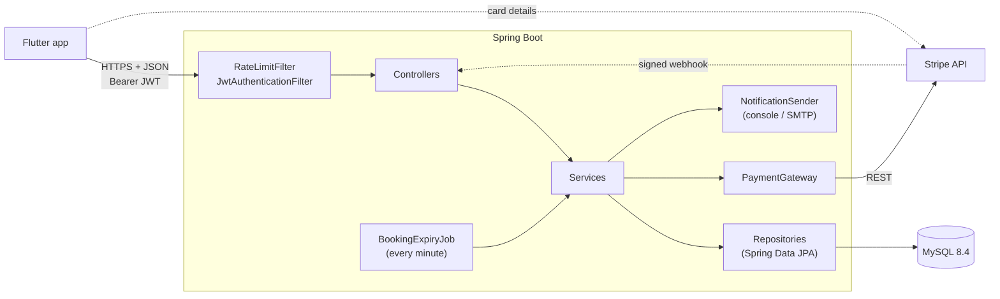
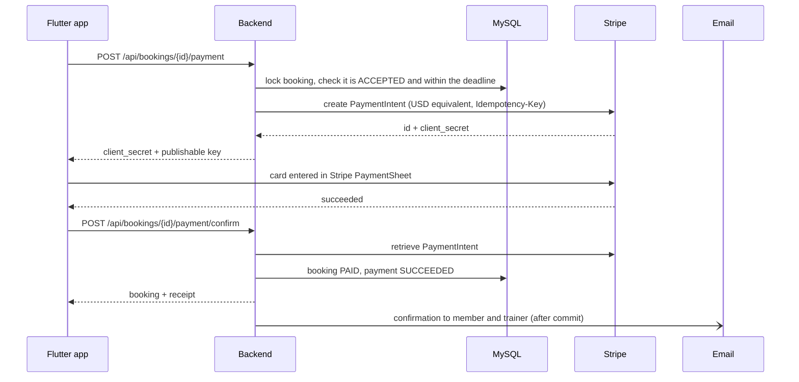

# Gym Booking API

A REST API for booking personal-training sessions across a gym chain. Members pick a trainer at one of five branches and request a time slot. The trainer accepts, the member pays through Stripe, and both get an email at each step.

[](https://github.com/Malikalqasrawi/gym-booking-backend/actions/workflows/ci.yml)


[](LICENSE)

Mobile client: [gym-booking-app](https://github.com/Malikalqasrawi/gym-booking-app) (Flutter)

## Why

Booking a trainer over the phone or by chat breaks in predictable ways. Two people get the same hour, a trainer never replies, a session is booked but never paid, or a late cancellation turns into an argument. This service makes those rules explicit and enforces them in one place:

- **No double booking.** Requests for the same trainer are serialized with a row lock, so two members can't get the same slot.
- **Nothing stays pending forever.** Trainers have 24 h to answer and accepted sessions must be paid within 12 h. After that, the slot is released automatically.
- **Payments are verified server-side.** Card details go straight from the app to Stripe, and the API confirms every payment with Stripe. Refunds are automatic when a paid session is cancelled at least 24 h in advance.
- **Data is scoped to its owner.** Members see their own bookings and trainers see requests addressed to them. Any other booking returns `404`.

## Features

| Area | Details |
|---|---|
| Accounts | Sign-up with email verification code, password reset by emailed code, change password, member / trainer / admin roles, lockout after 5 failed logins |
| Sessions | 15-minute JWT access tokens renewed with rotating refresh tokens (30 days), logout per device or on all devices |
| Two-factor login | Codes from an authenticator app (TOTP, RFC 6238), required for admins and optional for members and trainers, 8 one-time recovery codes, moving to a new phone |
| Branches & trainers | 5 branches with coordinates and opening hours, 22 trainer profiles, filters (category, gender, max rate), weekly schedules |
| Availability | Free start times per trainer, date and duration (30/45/60/90 min), based on working hours, branch hours and existing bookings |
| Bookings | Request, accept or decline, 24 h reply deadline, max 3 pending requests per member, cancellation rules |
| Payments | Stripe PaymentIntents (test mode), 12 h payment window, email receipts, automatic refunds, signed webhooks |
| Admin | Add trainers by email invite, edit profiles and weekly schedules, deactivate (cancels and refunds their upcoming bookings) or reactivate |
| Gym operations | See every booking with contact details, cancel any session before it starts (full refund), close a branch or give a trainer time off for whole days or set hours |
| Hardening | Per-IP rate limiting, owner-scoped queries, optimistic and pessimistic locking, secrets kept out of the repo |

## Architecture



Controllers handle HTTP and validation only, services own the business rules, and repositories handle persistence. External dependencies sit behind interfaces (`PaymentGateway`, `NotificationSender`, `RateLimiter`, `TokenService`), which keeps the rules independent of Stripe, SMTP or the JWT library and lets the tests replace them with fakes.

### Payment flow



## Design decisions

- **State lives in the entities.** `Booking` and `Payment` have no status setters. Transitions go through methods like `accept()`, `markPaid()`, `cancelByMember()` and `markRefunded()`, which reject invalid transitions with `409`.
- **Concurrency.** A booking request takes a pessimistic lock on the trainer row (`SELECT ... FOR UPDATE`) while it checks for overlaps. Payment, cancellation and webhook handling lock the booking row. Bookings also carry a `@Version` column, so conflicting updates fail with `BOOKING_CHANGED` instead of silently overwriting each other.
- **Stripe is the source of truth for payments.** The confirm endpoint and the webhook both re-fetch the PaymentIntent and check the amount. Neither trusts the client or the event body. Stripe calls carry an `Idempotency-Key`, and `payments.booking_id` is unique.
- **Late payments are refunded.** If a payment succeeds after the booking has expired or been cancelled, it is refunded right away and the client gets `PAID_TOO_LATE`.
- **Side effects run after commit.** Emails are triggered by domain events (`BookingPaidEvent`, `BookingRefundedEvent`) handled with `@TransactionalEventListener(AFTER_COMMIT)`. A rolled-back transaction never sends an email, and a mail failure never fails a request.
- **Plain REST instead of the Stripe SDK.** The API only needs three Stripe endpoints, so it calls them with Spring's `RestClient`. The integration tests then run against a local fake Stripe server instead of mocks.
- **Time is injected.** Services use a `Clock` in the gym's timezone (`Asia/Amman`), so deadlines are deterministic in tests (`MutableClock`).
- **Admins never know trainer passwords.** A trainer added by an admin gets an account with a random password and an emailed one-time invite code. Accepting the invite sets their own password. Deactivated trainers are hidden from members, their tokens stop working, and their upcoming bookings are cancelled by the gym with full refunds.
- **The gym can always cancel, and always refunds in full.** Members can't cancel a paid session in its last 24 hours, but the gym can until it starts. Cancelling a single booking, deactivating a trainer and blocking time all go through the same path: each booking is locked and re-checked, paid ones are refunded in full, and the member and trainer are emailed the reason.
- **Blocked times are applied in two places.** Availability never offers a blocked slot, and creating a block cancels the bookings already inside it. The admin first gets a preview of how many bookings that would be. Deleting a block frees the time again but doesn't restore cancelled bookings.
- **Expiry is enforced on read.** `Booking.statusAt(now)` already reports overdue bookings as expired, and the scheduled job persists that every minute, one transaction per booking.
- **Money.** Prices are `BigDecimal` in JOD, which has three decimal places (1 JOD = 1000 fils). Stripe can't charge JOD, so cards are charged the USD equivalent at the dinar's fixed peg (`ChargeConversion`), and receipts show both amounts. Charge currency and rate are configuration, so a JOD-capable provider needs no code change.
- **Short access tokens, rotating refresh tokens.** Access tokens last 15 minutes. Refresh tokens are random, stored only as SHA-256 hashes, and replaced on every use. If a replaced token shows up again later, someone may have copied it, so all of that user's sessions end. Every token carries the user's token version: changing or resetting the password, "log out of all devices" and deactivation raise it, which ends all existing sessions at once without a token blocklist.
- **Two-factor login in two steps.** A correct password for a two-factor account returns a challenge token instead of a session: a 10-minute JWT that only the code step accepts. The codes are computed in `Totp` (HMAC-SHA1 over 30-second steps, no library) and each code works once. Wrong codes count toward the same lock as wrong passwords, and entering the password again doesn't reset the count, so codes can't be guessed. Recovery codes are stored as SHA-256 hashes. An admin can't get a session without it, and admin sessions from before it was required are ended. The app's secret is stored as it is, because the server needs it to check codes; a production setup would encrypt it with a key from a secrets manager.
- **Secrets stay out of the repo.** Configuration comes from a git-ignored `local.properties` or `.env`. A pre-commit hook blocks key-like strings, and the app refuses to start with live Stripe keys.

## Tech stack

| | |
|---|---|
| Language | Java 21 |
| Framework | Spring Boot 3.5 (Web, Data JPA, Security, Validation, Mail) |
| Database | MySQL 8.4, Hibernate 6 |
| Auth | JWT (JJWT), BCrypt |
| Payments | Stripe REST API via `RestClient` |
| Tests | JUnit 5, H2, fake Stripe HTTP server |
| Delivery | Docker Compose, GitHub Actions |

## Getting started

### Docker

```bash
git clone https://github.com/Malikalqasrawi/gym-booking-backend.git
cd gym-booking-backend
cp .env.example .env    # fill in the values
docker compose up --build
```

The API runs on <http://localhost:8080>. `GET /api/health` returns `{"status":"UP", ...}`.

### Local (Maven)

Requires JDK 21+ and MySQL 8.4.

```bash
cp local.properties.example local.properties
bash scripts/create-db-user.sh    # creates the MySQL user "gymapp" and stores its password in local.properties
# add a JWT secret to local.properties: openssl rand -base64 64 | tr -d '\n'
# optional: set app.admin.initial-password in local.properties (otherwise a random one is printed once)
mvn spring-boot:run
```

The `gymdb` schema and its tables are created on first start. The `gymapp` user can only access `gymdb` and cannot drop tables.

### Demo data

On startup the app seeds any missing branches, trainers and the admin account (`admin@gym.com`). The admin password comes from `app.admin.initial-password` in `local.properties` (`ADMIN_PASSWORD` in `.env`). If it isn't set, a random password is generated and printed once in the log. Change it in the app under Profile > Change password. At the admin's first login, the app asks them to set up an authenticator app such as Google Authenticator or the iPhone's Passwords app. If the phone and the recovery codes are both lost, setting `two_factor_secret` to `NULL` for `admin@gym.com` in MySQL starts the setup again at the next login. The trainer accounts are demo data for local development only.

| Role | Email | Password |
|---|---|---|
| Trainer | `<firstname>.trainer@gym.com`, e.g. `sara.trainer@gym.com` | `Trainer1234` |

Trainers by branch: Abdoun (sara, yousef, rania, khaled, maya), Khalda (omar, dana, ahmad, hala), Sweifieh (lina, faris, noor, hamza, jana), Shmeisani (laith, ruba, qais, aya), Jubeiha (mohammad, leen, bashar, tala). Members sign up through the app.

### Configuration

Settings are in `src/main/resources/application.properties`. Secrets go in `local.properties` (or `.env` for Docker):

| Property | Env var (Docker) | Notes |
|---|---|---|
| `spring.datasource.password` | `DB_PASSWORD` | Set by `create-db-user.sh` |
| `app.jwt.secret` | `JWT_SECRET` | Required. Base64, 64+ bytes |
| `app.admin.initial-password` | `ADMIN_PASSWORD` | First admin's password; random and logged once if empty |
| `app.payments.stripe.secret-key` | `STRIPE_SECRET_KEY` | `sk_test_...` only |
| `app.payments.stripe.publishable-key` | `STRIPE_PUBLISHABLE_KEY` | `pk_test_...`, passed to the app |
| `app.payments.stripe.webhook-secret` | `STRIPE_WEBHOOK_SECRET` | Optional |
| `app.payments.charge-currency` / `app.payments.jod-exchange-rate` | | `USD` / `1.41044` (fixed peg). Use `JOD` / `1` with a provider that supports dinars |
| `app.notifications.mode` | | `console` (default) or `email` (uses `spring.mail.*`) |

Without Stripe keys the service still starts, and the payment endpoints return `503 PAYMENTS_NOT_CONFIGURED`.

### Stripe test mode

1. In the Stripe Dashboard (test mode), copy the keys from **Developers > API keys** into `local.properties`.
2. Pay with a test card, using any future expiry date and any CVC:

   | Card | Result |
   |---|---|
   | `4242 4242 4242 4242` | Succeeds (Visa) |
   | `5555 5555 5555 4444` | Succeeds (Mastercard) |
   | `4000 0000 0000 0002` | Declined |
   | `4000 0025 0000 3155` | Requires 3-D Secure |

3. Optional: forward webhooks with the Stripe CLI, then set the printed `whsec_...` as `app.payments.stripe.webhook-secret`:

   ```bash
   stripe listen --events payment_intent.succeeded --forward-to localhost:8080/api/payments/stripe/webhook
   ```

## API

All endpoints except `/api/health`, `/api/auth/**` and the Stripe webhook require `Authorization: Bearer <token>`.

### Auth

| Method | Path | Body | Response |
|---|---|---|---|
| POST | `/api/auth/signup` | `fullName, email, phone, password` | `201`, verification code sent by email |
| POST | `/api/auth/verify` | `email, code` | `200 {token, refreshToken, user}` |
| POST | `/api/auth/resend-code` | `email` | `200` |
| POST | `/api/auth/login` | `email, password` | `200 {token, refreshToken, user}`, or for two-factor accounts `200 {twoFactor, challengeToken}` with `twoFactor` = `CODE_REQUIRED` or `SETUP_REQUIRED` (an admin without an authenticator app yet) |
| POST | `/api/auth/login/2fa` | `challengeToken, code` | `200 {token, refreshToken, user}`. `code` is the 6-digit code from the app or a recovery code |
| POST | `/api/auth/login/2fa/setup` | `challengeToken` | `200 {secret, otpauthUri}` for an admin's first login; show `otpauthUri` as a QR code |
| POST | `/api/auth/login/2fa/confirm` | `challengeToken, code` | `200 {recoveryCodes, token, refreshToken, user}`; the admin's older sessions end |
| POST | `/api/auth/accept-invite` | `email, code, password` | `200 {token, refreshToken, user}`; for trainers added by an admin |
| POST | `/api/auth/forgot-password` | `email` | `200`. Emails a reset code (valid 10 minutes) to a verified account; the same answer whether or not the email exists |
| POST | `/api/auth/reset-password` | `email, code, password` | `200`; then log in with the new password. Also lifts a login lock |
| POST | `/api/auth/refresh` | `refreshToken` | `200 {token, refreshToken, user}`; the old refresh token stops working |
| POST | `/api/auth/logout` | `refreshToken` | `204`; ends this device's session |
| GET | `/api/users/me` | | `200` current user, including `twoFactorEnabled` |
| POST | `/api/users/me/password` | `currentPassword, newPassword` | `200 {token, refreshToken, user}`; other devices are logged out |
| POST | `/api/users/me/logout-all` | | `204`; ends every session on every device |
| POST | `/api/users/me/2fa/setup` | `password, code?` | `200 {secret, otpauthUri}`. `code` (from the current app, or a recovery code) only when two-factor is already on, to move to a new phone |
| POST | `/api/users/me/2fa/confirm` | `code` | `200 {recoveryCodes}`; turns two-factor on with a code from the new app and replaces old recovery codes |
| POST | `/api/users/me/2fa/disable` | `password, code` | `204`; not allowed for admins (`403 TWO_FACTOR_REQUIRED`) |

### Branches and trainers

| Method | Path | Role | Notes |
|---|---|---|---|
| GET | `/api/branches` | any | Optional `?city=` |
| GET | `/api/branches/{id}` | any | |
| POST / PUT / DELETE | `/api/branches[/{id}]` | admin | A branch with trainers or bookings can't be deleted (`409 BRANCH_IN_USE`) |
| GET | `/api/branches/{id}/trainers` | any | Optional `?category=&gender=&maxRate=` |
| GET | `/api/trainers/{id}` | any | Profile and weekly schedule |
| GET | `/api/trainers/{id}/availability?date=&duration=` | any | Free start times. `duration` is 30/45/60/90, `date` is within the next 14 days. `closedReason` is set when the branch is closed or the trainer is off all day |

### Admin: trainers

| Method | Path | Notes |
|---|---|---|
| GET | `/api/admin/trainers` | All trainers with status (`INVITED`, `ACTIVE`, `DEACTIVATED`), contact details, schedule and upcoming bookings |
| GET | `/api/admin/trainers/{id}` | |
| POST | `/api/admin/trainers` | Creates the trainer and emails an invite code (valid 7 days) |
| PUT | `/api/admin/trainers/{id}` | Edits details; a new email address for an invited trainer gets a fresh invite |
| PUT | `/api/admin/trainers/{id}/schedule` | `{blocks: [{dayOfWeek, startTime, endTime}]}` replaces the weekly schedule |
| POST | `/api/admin/trainers/{id}/invite` | Sends a new invite code |
| POST | `/api/admin/trainers/{id}/deactivate` | Optional `{reason}`, shown to members whose bookings are cancelled |
| POST | `/api/admin/trainers/{id}/reactivate` | |

### Admin: bookings and blocked times

| Method | Path | Notes |
|---|---|---|
| GET | `/api/admin/bookings` | Sessions that haven't ended, soonest first. `?past=true` lists ended ones (latest 200). Optional `branchId`, `trainerId`, `status`. Adds member email and phone, and `gymCanCancel` |
| GET | `/api/admin/bookings/{id}` | |
| POST | `/api/admin/bookings/{id}/cancel` | Optional `{reason}`. Allowed until the session starts; a paid session is refunded in full |
| GET | `/api/admin/blocked-times` | Blocks that haven't ended |
| POST | `/api/admin/blocked-times/preview` | Same body as below; returns `{bookings, paidBookings}` it would cancel |
| POST | `/api/admin/blocked-times` | `{branchId or trainerId, startDate, endDate, startTime?, endTime?, reason?}`. Without times the whole days are blocked. Cancels the bookings inside |
| DELETE | `/api/admin/blocked-times/{id}` | Frees the time again |

### Bookings

| Method | Path | Role | Notes |
|---|---|---|---|
| POST | `/api/bookings` | member | `{trainerId, date, startTime, durationMinutes, note?}` |
| GET | `/api/bookings/mine` | member | |
| GET | `/api/bookings/{id}` | member | |
| POST | `/api/bookings/{id}/cancel` | member | Refunds automatically if paid |
| GET | `/api/trainer/requests` | trainer | Pending requests, most urgent first |
| GET | `/api/trainer/schedule` | trainer | Upcoming accepted and paid sessions |
| POST | `/api/trainer/requests/{id}/accept` | trainer | Optional `{message}` |
| POST | `/api/trainer/requests/{id}/reject` | trainer | Optional `{message}` |

Booking lifecycle:

```
REQUESTED -> ACCEPTED -> PAID
    |            |         |
    |            |         +-> CANCELLED (until 24 h before, full refund)
    |            +-> EXPIRED (not paid within 12 h) / CANCELLED
    +-> REJECTED / EXPIRED (no answer within 24 h) / CANCELLED
```

The gym can cancel any booking until it starts (for example when a trainer is deactivated); paid ones are always refunded in full.

### Payments

| Method | Path | Caller | Notes |
|---|---|---|---|
| POST | `/api/bookings/{id}/payment` | member | Creates or reuses the PaymentIntent and returns `clientSecret` and `publishableKey` |
| POST | `/api/bookings/{id}/payment/confirm` | member | Verifies the PaymentIntent with Stripe and marks the booking `PAID` |
| POST | `/api/payments/stripe/webhook` | Stripe | Verified by `Stripe-Signature` |

### Errors and limits

Errors share one format:

```json
{ "status": 409, "code": "SLOT_NOT_AVAILABLE", "message": "...", "fieldErrors": {}, "timestamp": "..." }
```

| Limit | Value | Response |
|---|---|---|
| `/api/auth/**` per IP | 10 / min | `429 RATE_LIMITED` |
| Other endpoints per IP | 100 / min | `429 RATE_LIMITED` |
| Verification code resend | 1 / 60 s | `429 RESEND_TOO_SOON` |
| Wrong passwords or two-factor codes | 5 in a row, then 15 min lock | `429 ACCOUNT_LOCKED` |
| Wrong verification codes | 5 per code | `400 TOO_MANY_ATTEMPTS` |

`429` responses include `Retry-After`. All limits are configurable in `application.properties`.

## Project structure

```
src/main/java/com/mycompany/gymbooking
├── config/         security, clock, seed data, schema upgrades
├── controller/     REST endpoints
├── dto/            request and response records
├── exception/      API exceptions and the global handler
├── model/          JPA entities and enums
├── notification/   email senders and payment email listener
├── payment/        PaymentGateway, Stripe client, webhook verification
├── repository/     Spring Data repositories
├── security/       JWT, two-factor codes (TOTP), rate limiting, security error handling
└── service/        business logic and the expiry job
```

## Tests

```bash
mvn verify
```

83 tests. They need no MySQL, network or Stripe account.

| Test | Covers |
|---|---|
| `BookingTest` | Booking state machine, deadlines, expiry, 24 h cancellation rule, gym cancellations |
| `TrainerTest` | Trainer status (invited, active, deactivated) and when a trainer is bookable |
| `PaymentTest` | Payment status transitions |
| `CurrencyUnitsTest` | Minor units per currency and amounts Stripe cannot charge |
| `ChargeConversionTest` | JOD to USD conversion and rounding |
| `StripeWebhookVerifierTest` | Signature and timestamp checks |
| `StripePaymentGatewayTest` | Requests sent to Stripe, idempotency, error handling |
| `InMemoryRateLimiterTest` | Token bucket refill and `Retry-After` |
| `TotpTest` | Authenticator codes against the RFC 6238 test values, Base32, clock drift, the QR code link |
| `SessionApiTest` | End-to-end: refresh token rotation and reuse, logout, logout on all devices, change password |
| `TwoFactorApiTest` | End-to-end: admin setup at first login, codes and recovery codes, used codes, lockout, expired challenges, moving to a new phone, turning it off |
| `GymBookingApiTest` | End-to-end over HTTP: auth, password reset, roles, access control, double booking, payment and refund flow, declines, webhooks, late payments, Stripe outages |
| `AdminTrainerApiTest` | End-to-end: admin-only access, invite flow, validation, editing, schedules, deactivation with refunds, branches in use |
| `AdminBookingApiTest` | End-to-end: admin bookings list and filters, gym cancellations with refunds, trainer and branch blocks, validation |

CI runs the test suite and a Docker Compose smoke test on every push and pull request.

## Roadmap

- [x] Accounts, email verification, JWT, roles
- [x] Branches, trainers, availability
- [x] Booking requests, accept / decline, expiry
- [x] Stripe payments, refunds, confirmation emails
- [x] Admin: trainer invites, profiles, weekly schedules, deactivation
- [x] Admin: all bookings, gym cancellations, blocked times, branch management
- [x] Refresh tokens, logout on all devices, change password
- [x] Two-factor authentication with an authenticator app
- [ ] Google sign-in

## License

[MIT](LICENSE)
